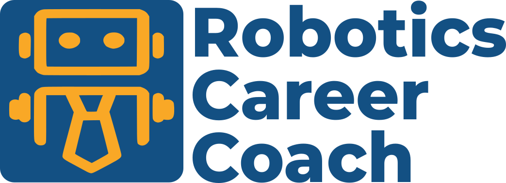

  

  <em>Helping individuals and organizations navigate the rapidly growing robotics industry.</em>

# Educational Resources

A curated collection of free online tutorials, courses, textbooks, and documentation for anyone pursuing a career in robotics. These resources are gathered from across the web and cover topics ranging from ROS 2 and software engineering to computer vision, embedded systems, mechanical design, and machine learning. All links point to freely available materials to help learners build the skills they need without cost being a barrier.

## Topics

| Topic | Description |
|-------|-------------|
| [ROS 2](topics/ros2.md) | The standard robotics middleware — nodes, topics, services, and client libraries |
| [Software Engineering](topics/software-engineering.md) | Python, C++, Git/GitHub, and CI/CD fundamentals |
| [Computer Vision](topics/computer-vision.md) | Image processing, OpenCV, and deep learning for vision |
| [Embedded Systems](topics/embedded-systems.md) | Microcontrollers, firmware, real-time systems, and serial comms |
| [Mechanical Engineering & CAD](topics/mechanical-engineering-and-cad.md) | 3D modeling, parametric design, and mechanical fundamentals |
| [Machine Learning & AI](topics/machine-learning-and-ai.md) | Intro ML, reinforcement learning, and ML for perception |
| [Cloud & DevOps](topics/cloud-and-devops.md) | Docker, cloud deployment, and GitHub Actions |
| [Simulation](topics/simulation.md) | Gazebo, Isaac Sim, and other robot simulators |

## Getting Started

See the [Suggested Learning Path](learning-path.md) for a staged, week-by-week plan that takes learners from foundations through a capstone project.

## A Note on Online Courses

Several resources live on Coursera or edX. These can be **audited for free** (full access to videos and materials), but graded assignments and certificates require payment or financial aid. The audit option is noted wherever it applies.

## Contributing

If you know of a free resource that should be listed here, open a pull request or raise an issue. Please credit the original authors, instructors, and institutions that created and published the resource.

We do our best to properly attribute every resource, but errors and omissions can happen. If you notice an incorrect or missing credit, please open a pull request with the correction, create an issue, or contact us at info@roboticscareercoach.com.
